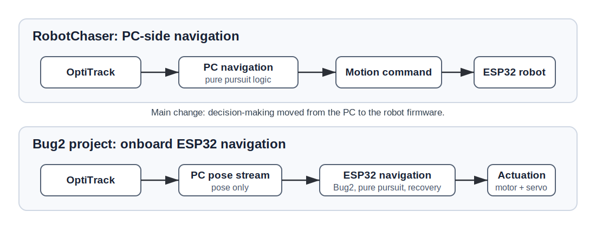
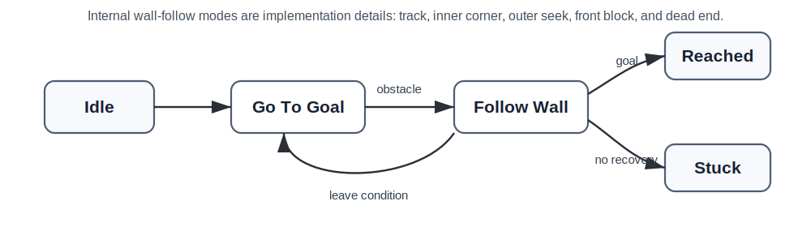
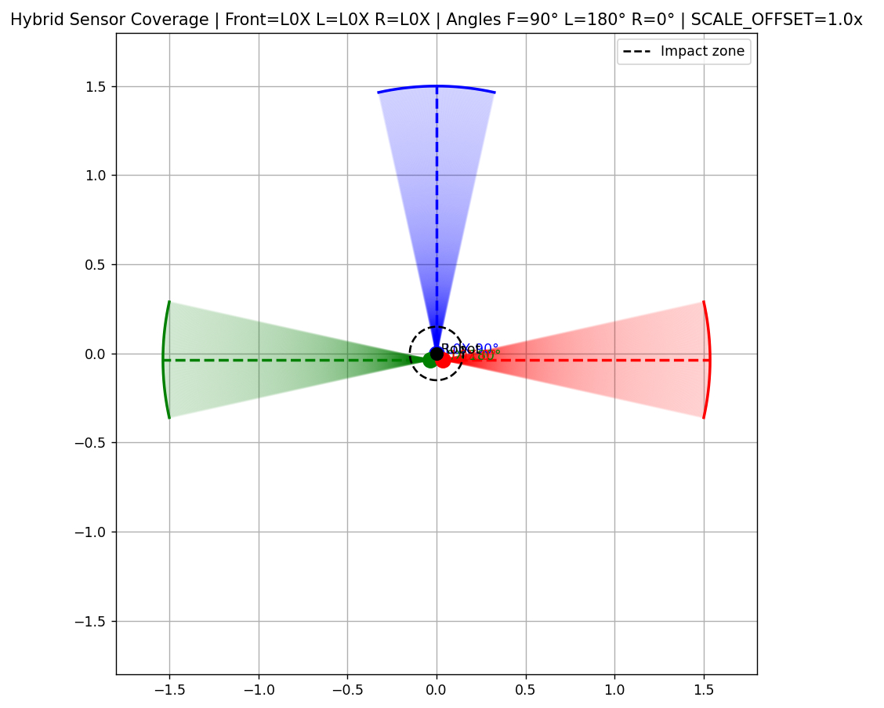
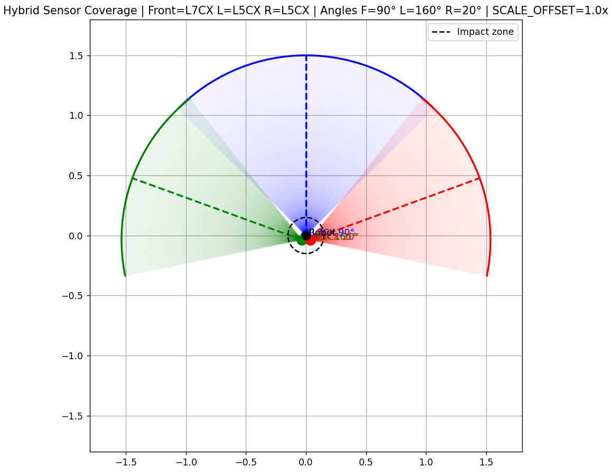
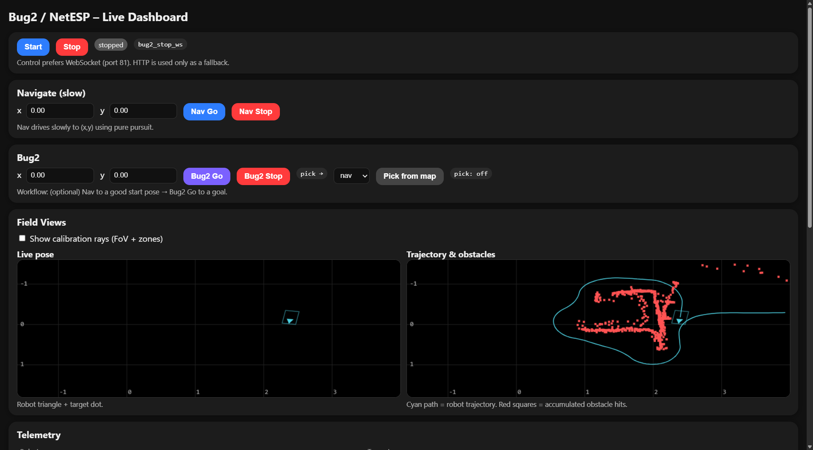
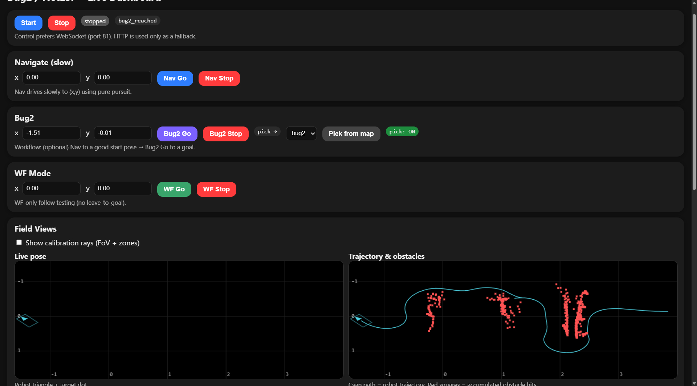

# Bug2 Autonomous Robot

## Engineering Reflection and Project Summary

## Executive Summary

This project extends **RobotChaser**, an earlier IoT-course robot, into a more autonomous Bug2-based navigation platform. RobotChaser used OptiTrack for pose sensing, but most navigation logic ran on a PC. The PC computed pure-pursuit motion commands and sent them to the ESP32 robot, which mainly executed those commands.

The Bug2 project changed this architecture. OptiTrack pose data still arrives from the PC, but navigation and decision-making now run onboard the ESP32. The robot firmware handles go-to-goal motion, obstacle sensing, wall following, recovery behavior, telemetry, runtime tuning, and motor/servo control. The project therefore shifted from PC-controlled target following toward embedded robotic autonomy.

The work was iterative and practical. It required repeated hardware integration, sensor redesign, steering calibration, telemetry tooling, runtime tuning, and physical testing. Several algorithmic approaches were explored, evaluated, and sometimes replaced. The resulting system is an engineering reflection on how a classroom navigation algorithm must be adapted for a real Ackermann-steered robot with imperfect sensors and hardware constraints.

## 1. Architecture Evolution

RobotChaser was designed around target following. OptiTrack measured the robot and target positions, the PC ran pure pursuit, and the ESP32 received motion commands. That architecture was suitable when the main problem was following a moving target in a known space.

Bug2 introduced a different requirement: the robot needed to make local decisions around obstacles. It had to decide when to leave go-to-goal motion, how to follow a wall, how to recover when blocked, and how to interpret local sensor data. For these behaviors, keeping the PC as the main decision-maker was less suitable. The ESP32 needed to own the navigation loop.

The current firmware is organized into modules for sensing, Bug2 behavior, pure pursuit, motion control, UDP pose input, motor and servo control, obstacle visualization, Wi-Fi, and the browser UI. The main loop selects the active controller: calibration tests, navigation, Bug2, or fallback pure pursuit. This separation also fixed an earlier class of problems where multiple controllers could influence motion at the same time.

  
  
Figure 1. This diagram illustrates the architectural shift from PC-side navigation in RobotChaser to onboard ESP32 navigation in the Bug2 project. The PC remains part of the system, but mainly as the OptiTrack pose-data source.

## 2. Algorithmic Evolution

Pure pursuit remained important, but its role changed. In RobotChaser, pure pursuit was the primary target-following algorithm. In the Bug2 project, pure pursuit became the **go-to-goal** controller: when the route is clear, the robot steers toward the goal using pure pursuit.

Obstacle behavior evolved through several versions. The early Bug2 implementation used a simple state-machine structure with alignment, wall following, and wall seeking. This exposed practical issues such as oscillation, wrong-side wall selection, late front-obstacle response, and repeated alignment loops.

A later v1 experiment used explicit servo phases such as stop, rotate, and follow. This was easier to reason about, but it did not fit the platform well because an Ackermann-steered robot cannot rotate in place like a differential-drive robot.

The v2 experiment used a VFH-like local waypoint approach. Sensor zones were projected into space, candidate directions were scored, and pure pursuit steered toward a temporary waypoint. This was conceptually clean, but failures became harder to diagnose because too many layers sat between sensor evidence and robot action.

The current v3 approach uses direct zone-combo wall following. Instead of generating local waypoints, the controller reads front, side, corner, and opening patterns from the sensors and makes priority-ordered decisions. This is less abstract, but it is easier to log, inspect, and tune on the physical robot.

The firmware supports both Full Bug2 and wall-follow-only testing. Full Bug2 combines go-to-goal behavior, obstacle encounter, wall following, M-line leave/rejoin behavior, and return-to-goal logic. Wall-follow-only mode was added so the most difficult part of the behavior could be tuned without running a complete Bug2 route every time.

  
  
Figure 2. This simplified Bug2 state diagram shows the main navigation flow between idle, go-to-goal, wall-follow, reached, and stuck states. Internal wall-follow modes such as track, inner corner, outer seek, front block, and dead end refine the Follow Wall state.

## 3. Sensor Redesign and Dead-Zone Reasoning

The earlier platform used sparse VL53L0X time-of-flight sensing, which provided only a small number of single-distance measurements. This was useful for basic obstacle awareness, but it created blind regions during diagonal approaches, corner transitions, and wall-following behavior. For an Ackermann-steered Bug2 robot, delayed obstacle visibility is especially problematic because the robot requires turning distance and cannot rotate in place.

  
  
Figure 3. This earlier sparse-sensor coverage diagram illustrates why single-distance range sensing left blind regions around diagonal approaches and wall transitions.

The sensor system changed because Bug2 requires more than a single front distance. Wall following depends on where an obstacle is: directly ahead, along the side, at a corner, or opening away from the robot. These dead zones were difficult for an Ackermann-steered platform because detecting an obstacle late can leave too little room to recover.

The project upgraded to three matrix time-of-flight sensors:

- Left VL53L5CX.
- Middle VL53L7CX.
- Right VL53L5CX.

Each sensor provides an 8x8 matrix. The firmware compresses each matrix into horizontal zones, giving the controller a richer angular view than a single distance value. This made it possible to distinguish front blockage, side walls, inner corners, outer openings, and diagonal front-side projections.

More sensor data also required more filtering. The firmware masks floor-facing rows, rejects invalid readings, handles clear/out-of-range values, reduces single-cell flicker, and applies short temporal filtering. Calibration assets, including angle-meter sheets and coverage diagrams, were used to compare the assumed field of view with observed sensor behavior.

  
  
Figure 4. This coverage diagram shows the hybrid sensor arrangement with a front L7CX sensor and left/right L5CX sensors. The overlapping fields of view illustrate how the redesign reduced blind regions compared with sparse single-distance sensing.

## 4. Telemetry and Debugging Methodology

The project invested heavily in observability. The ESP32 serves a browser dashboard that displays pose, target, sensor data, Bug2 state, steering commands, and obstacle/path visualization. This was necessary because physical robot failures often look similar from the outside. A late turn near a wall, for example, could be caused by weak sensor evidence, delayed front-block detection, servo limits, controller tuning, or recovery logic.

The runtime logs include Bug2 state, wall-follow side, internal mode, sensor zone values, servo commands, and steering terms. This made tuning more systematic. The basic workflow became:

1. Run the robot on a physical scenario.
2. Save logs and screenshots.
3. Identify the failure pattern.
4. Tune parameters or adjust logic.
5. Re-test and compare with previous checkpoints.

Dated notes, screenshots, backup files, and git history show this process clearly. Some changes improved behavior, while others were reverted after testing. That record presents the project as an iterative robotics effort rather than a one-pass implementation.

  
  
Figure 5. This dashboard screenshot shows the onboard debugging environment, including controls, live pose, robot trajectory, accumulated obstacle detections, and telemetry context. The visualization helped connect physical robot behavior with internal navigation decisions.

  
  
Figure 6. This later dashboard screenshot shows a representative Full Bug2 run with the interface reporting bug2_reached. The trajectory view provides visual evidence of goal-directed continuation after wall following and successful return-to-goal behavior.

## 5. Engineering Challenges

The first major challenge was Ackermann steering. Many textbook Bug2 examples assume a point robot or a differential-drive robot. This robot has a steering radius, servo limits, steering lag, and different behavior when reversing. Wall following and recovery logic had to respect what the platform could physically execute.

The second challenge was sensor interpretation. Sparse sensors caused dead zones, but matrix sensors introduced filtering and calibration problems. The controller needed stable zone evidence, not raw minimum distances alone.

The third challenge was hardware variability. The steering servo was replaced with an MG90S after the earlier SG90 became unreliable. This changed steering range and curvature response, so previous tuning could not simply be reused. The project added new range limits, curve tests, and steering shaping to handle asymmetry.

The fourth challenge was recovery behavior. The robot needed to handle wall loss, front blockage, side-critical cases, dead ends, and emergency reverse behavior. These cases required repeated physical testing because they occur where ideal algorithm logic meets real robot constraints.

The project also had to abandon or revert ideas when tests showed they were not robust enough. The VFH/local-waypoint version was replaced because it was harder to debug. Some exit and opening heuristics were reverted because they degraded behavior. Servo stall detection was disabled because it produced false positives without real servo feedback.

## 6. Current Status and Future Work

The project completed several important systems:

- Onboard ESP32 navigation architecture.
- Pure-pursuit go-to-goal behavior.
- Bug2-style wall-follow controller.
- Matrix time-of-flight sensor integration.
- Sensor filtering and calibration tools.
- Embedded UI, telemetry, and obstacle visualization.
- Runtime tuning support.
- Wall-follow-only testing mode.
- Servo replacement and steering calibration support.

The system should still be described honestly as an actively tuned robotics platform. Full Bug2 leave/rejoin and reached-state behavior is implemented and represented in recent logs and screenshots, but broader validation across repeatable obstacle layouts and scenarios remains future work. The most useful next steps are to test Full Bug2 on fixed obstacle layouts, finalize sensor field-of-view calibration, refine front-block and emergency recovery behavior, and preserve final successful logs, screenshots, and videos for academic evidence.

## 7. Lessons Learned

The first lesson is that autonomy is an architectural choice. Moving from RobotChaser to Bug2 changed where the robot's intelligence lived. The ESP32 became responsible for local decisions instead of only executing PC commands.

The second lesson is that physical constraints shape robotics software. Steering geometry, servo range, motor deadband, sensor mounting, floor reflections, and hardware failures all affected the controller.

The third lesson is that debugging tools are part of the system. The dashboard, logs, screenshots, and runtime tuning endpoints were necessary for understanding and improving behavior.

The fourth lesson is that simpler, inspectable logic can be better than a more general planner on a small physical robot. The final zone-combo wall-follow controller was chosen because its decisions could be connected directly to sensor evidence and observed behavior.

## Conclusion

This project documents a practical transition from a PC-controlled pure-pursuit RobotChaser to an onboard ESP32 Bug2 navigation system. The work combined architecture redesign, sensor upgrades, wall-follow algorithm development, steering calibration, telemetry tooling, and repeated physical testing. The result is a concise but realistic embedded robotics platform: not a perfectly finished product, but a well-instrumented system that demonstrates how classroom navigation ideas must be adapted, tested, and revised on real hardware.

